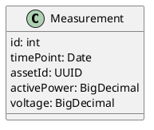
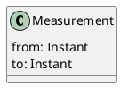

##Domain Model

### Challenge v2 module

This chapter describes the domain model for the Challenge v2 modul. Main building blocks of the domain
model are illustrated with the following UML diagrams.

####Measurement

An entity representing a measurement from an energy asset.

Field               | Description
---                 |---
id                  | Id of the measurement
timePoint           | Date and time of measurement
assetId             | Id of the measurement asset
activePower         | Power measured
voltage             | Voltage measured

####MeasurementByRange

An entity representing date and time range to retrieve measurements.

Field               | Description
---                 |---
from                | From which instant(date and time)
to                  | To which instant(date and time)
